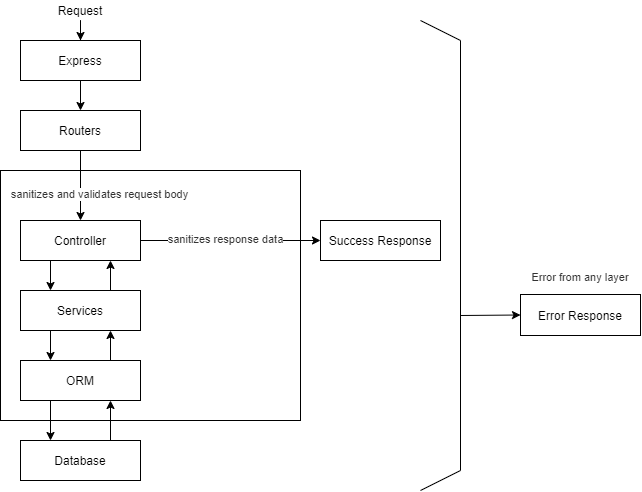
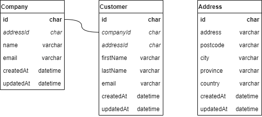
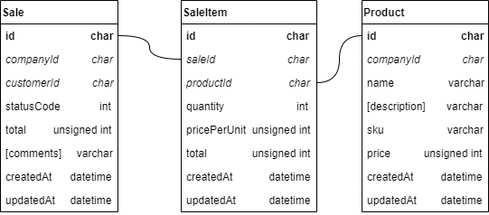

# Express API Reference

An exercise in creating a small Express.js API with AWS Cloud Development Kit (CDK).

The idea is to build the foundations and tooling (dev environment, infrastructure, and a small reference API) as a sample boilerplate.


## Contents
- [Express API Reference](#express-api-reference)
  - [Contents](#contents)
  - [1. API Design](#1-api-design)
    - [1.1 Request Data Flow](#11-request-data-flow)
    - [1.2 Data Models](#12-data-models)
      - [Company - Customer Relations](#company---customer-relations)
      - [Sale - Product Relations](#sale---product-relations)
  - [2. Development Environment](#2-development-environment)
    - [2.1 Features](#21-features)
    - [2.2 Prerequisites](#22-prerequisites)
    - [2.3 Setup](#23-setup)
    - [2.4 Commands](#24-commands)
  - [3. Run API Server](#3-run-api-server)
  - [4. Run Tests](#4-run-tests)
  - [5. AWS CDK Deployments](#5-aws-cdk-deployments)
    - [5.1 Prerequisites](#51-prerequisites)
    - [5.2 Deploy to Region: us-west-2](#52-deploy-to-region-us-west-2)
  - [6. Database Migrations](#6-database-migrations)
    - [6.1 Deployments (automated migrations)](#61-deployments-automated-migrations)
    - [6.2 Local Environment (run migrations)](#62-local-environment-run-migrations)
    - [6.3 New Migration (generate sql automatically)](#63-new-migration-generate-sql-automatically)
    - [6.4 Migration Strategy (break up breaking changes)](#64-migration-strategy-break-up-breaking-changes)


## 1. API Design


### 1.1 Request Data Flow

There are many more modules that are required for this to work as a real-world API, such as user authentication and authorization. Many existing modules also needs more refinement.




### 1.2 Data Models

These are over-simplified data models. Real-world business models will have more complicated relations and business logic.

#### Company - Customer Relations


#### Sale - Product Relations



## 2. Development Environment

All the development and deployments will be done within a development container ([devcontainer](https://code.visualstudio.com/docs/remote/containers)) running a variation of Debian.

A couple things devcontainer does not contain:
- all Docker commands in devcontainer are forwarded and are run on the host's Docker engine
- host's `~/.aws` credentials are forwareded into the devcontainer for CDK deployments

### 2.1 Features

There are two environments inside the devcontainer: `dev` and `test`. They have identical features:
- Express API server with various modes (hot-reload, debugging)
- MySQL database 5.7 (auto-starts with devcontainer)
- Database migration (up, down, reset, auto-generate SQL)
- AWS CDK deployment for API server, database, and database migration
- Jest test suites

`dev` and `test` each have their own separate MySQL database (identical configuration except for port). API server also has different ports for each environment.

### 2.2 Prerequisites

- Operating System: Ubuntu 20.04
- [Install VSCode](https://code.visualstudio.com)
  - [Install VSCode extension: Remote - Containers](https://marketplace.visualstudio.com/items?itemName=ms-vscode-remote.remote-containers)
- [Install Docker Engine [version 20.10.2+]](https://docs.docker.com/engine/install)
  - If you don't have sufficient permissions to run Docker without root user, [add your user to docker group](https://docs.docker.com/engine/install/linux-postinstall)
- [Install Docker Compose [version 1.29.1+]](https://docs.docker.com/compose/install)

### 2.3 Setup

The devcontainer setup process is automated and should only take 5 - 10 minutes.

1. Open folder in VSCode
2. Run **Remote-Containers: Open Folder in Container...** from command palette (`F1`)

    Once the setup completes, the folder would open in VSCode like any other project. To ensure you are inside the devcontainer, check VSCode's status bar on bottom left corner. It should say "**Dev Container: ear devcontainer**".

3. Run database migration scripts for one or both environments:
    ```
    ear migrations:run
    ear 2:migrations:run
    ```

All environment variables are in the file **.devcontainer/.env**. The defaults does not need to be changed for local development and testing, but can be changed.

Anytime you want to develop in the devcontainer, run **Remote-Containers: Reopen Folder in Container** from command palette (`F1`).

### 2.4 Commands

There are two environments: `dev` or `test`. Both environments have identical features.

Running commands as listed below uses the `dev` environment, whereas appending `2:` to the command would use the `test` environment:
- e.g. `ear mysql` starts mysql client for `dev`
- e.g. `ear 2:mysql` starts mysql client for `test`

The `ear` command is a bash alias to `npm run`.

Environment specific commands:
- `ear mysql` - start mysql client
- `ear server` - start server with hot-reload
- `ear server:debug` - start server with hot-reload in debug mode (F5 to start debugging)
- `ear server:production` - start server in Docker container (will be compiled)
- `ear test` - run tests in watch mode
- `ear test [test-suite-name]` - only run tests matching test-suite-name, in watch mode
- `ear test:production` - run tests against server running in a Docker container
- `ear migrations:run` - run all upgrade migrations scripts
- `ear migrations:run 0` - run all downgrade migrations scripts (results in empty database)
- `ear migrations:run [target-version]` - run migration scripts to targetted db schema version
- `ear migrations:reset` - run all downgrade migration scripts, then all upgrade migration scripts
- `ear migrations:generate [migration-name]` - generate new migration based on differences in current database schema and TypeORM models (.model.ts files)
- `ear api [model] [method] -- [--arguments=value]` invoke a faker call to create a resource/dto for specified model

Environment-agnostic commands:
- `ear help` - shows this command list
- `ear gen:index-export [target-folder]` - generate index.ts exporting all files within target folder


## 3. Run API Server

Once the API server is started (default listens to port 4000 in `dev` -- **.devcontainer/.env**), devcontainer forwards the port to the local computer, and becomes accessible from your local browser and apps.

- development mode (hot-reloads)
  ```
  ear server
  ```
- debug mode (`F5` to start debugger)
  ```
  ear server:debug
  ```
- production mode (Docker container - deployments to AWS use this)
  ```
  ear server:production
  ```


## 4. Run Tests

The tests run against a live server. So an instance of the API server must be running.

- run tests
  ```
  ear test
  ```
- only run tests matching test-suite-name (e.g. **ear dev:test /companies**)
  ```
  ear test [test-suite-name]
  ```
- run tests against production mode (API server running in Docker container)
  ```
  ear test:production
  ```


## 5. AWS CDK Deployments

### 5.1 Prerequisites

- [Configure AWS credentials](https://docs.aws.amazon.com/cdk/latest/guide/getting_started.html#getting_started_prerequisites) and permissions
  - Only credentials stored in `~/.aws` will work, environment variables will not be forwarded to devcontainer for security reasons
  - Ensure to change environment variable in file [.devcontainer/.env](.devcontainer/.env) with key `AWS_DEV_ACCOUNT_ID` set to your AWS account ID
  - Root account needs to [grant the the user various permissions](docs/aws-deployment-account-permissions.md)
- [Create new AWS Secret](https://us-west-2.console.aws.amazon.com/secretsmanager/home?region=us-west-2#!/listSecrets) named `dev/api/usw2` (the values are arbitrary, change it as you please):
    ```json
    {
      "EAR_DB_NAME": "express_api_ref",
      "EAR_DB_USER": "madison",
      "EAR_DB_PASSWORD": "reasonablylongpassword"
    }
    ```
    The Secret name is defined in [cdk/main.ts](cdk/main.ts) per-environment.

### 5.2 Deploy to Region: us-west-2

1. Run:
    ```
    cdk bootstrap
    cdk deploy dev-api-usw2
    ```
    Database migrations are run as part of the deployment. Database schema version is defined in [cdk/main.ts](cdk/main.ts) per-environment.

2. Find API server URL:
    1. Visit EC2 > Load Balancing > [Load Balancers](https://us-west-2.console.aws.amazon.com/ec2/v2/home?region=us-west-2#LoadBalancers:)
    2. Select the Load Balancer named something like `dev-a-ApiFa-1GQ2S7MAC0J4W`
    3. Scroll down on Description > Basic Configuration to find the **DNS name**, it should be something like `dev-a-ApiFa-1GQ2S7MAC0J4W-925956588.us-west-2.elb.amazonaws.com`

3. Test with the API then destroy it to save money:
    ```
    cdk destroy dev-api-usw2
    ```
    If stacks fail to be deleted, manually delete them in [CloudFormation](https://us-west-2.console.aws.amazon.com/cloudformation/home?region=us-west-2).


## 6. Database Migrations

### 6.1 Deployments (automated migrations)

Database migration scripts are automatically run when deploying through CDK. The database schema target version is defined in [cdk/main.ts](cdk/main.ts) per-environment.
```typescript
new MainStack(app, 'dev-api-usw1', {
  env: {
    // leaving empty would run all upward migration scripts (latest)
    dbSchemaVersion: '20210503101932-init',
    ...
  },
});
```

### 6.2 Local Environment (run migrations)

- run all migration up scripts
  ```
  ear migrations:run
  ```
- run all migration down scripts
  ```
  ear migrations:run 0
  ```
- run all migration up or down scripts up to targetted db schema version
  ```
  ear migrations:run [target-version]
  ```

### 6.3 New Migration (generate sql automatically)

Generate a new migration script (raw SQL) based on differences in the actual MySQL database (`dev` or `test`) and TypeORM models (.model.ts files).

Run command (name can be something short, such as **init**):
```
ear migrations:generate [name]
```
This will generate 3 files with filename consiting of `[timestamp]-[name]`. This is the db schema version.
```
Example of generated files:
db/migrations/20210503101932-init.js
db/migrations/sqls/20210503101932-init-down.sql
db/migrations/sqls/20210503101932-init-up.sql
```

### 6.4 Migration Strategy (break up breaking changes)

[Expand and Contract](https://www.tim-wellhausen.de/papers/ExpandAndContract/ExpandAndContract.html). Besides the regular database backup, any breaking changes should be implemented in multiple migrations and individual migrations are not breaking changes themselves.

For example, to rename `table.col1` to `table.col2`, we would have these individual migration:
1. add `table.col2` and copy all data from `table.col1`, ensure that `table.col1` is no longer used
2. drop `table.col1`